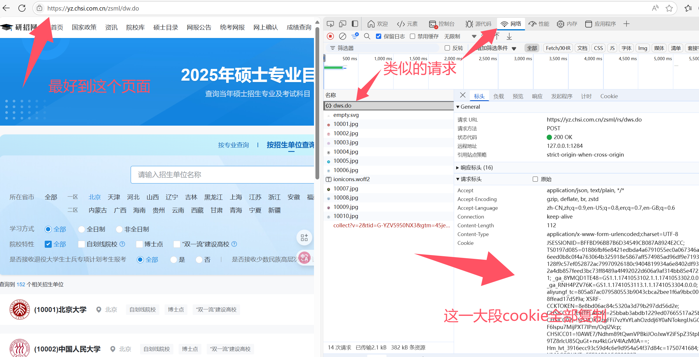

# 爬取研招网专业信息
## 创作不易，请给我点个Star⭐️

## 免责声明
本项目依据 MIT 许可证发布，仅供学习和研究使用，所爬取的数据均来自公开且合法的渠道，且项目设计不会对目标网站造成流量攻击或其他负面影响。请确保在合法合规的前提下使用本项目。

作者不对因使用本项目所导致的任何直接或间接后果承担责任。使用者应自行评估风险并对其行为负责。


## 介绍
本项目从研招网爬取专业信息，数据存储在 MySQL 数据库中。
使用`专业代码-考试方式-院系所-学习方式-研究方向`这五个作为唯一索引存储数据（可能会漏掉极少数仅仅跟别的专业在是否是退役计划处不同的专业）。

大致情况如图：


## 使用方法
使用本项目需要具备：下载项目、下载python依赖、创建数据库等非常基础的技能，在Ai协助下0基础大概率也能完成

1. 克隆项目到本地
   ```bash
   git clone https://github.com/freecho/yzw.git
   ```
2. 安装依赖(建议使用pycharm自带的虚拟环境，python版本建议：3.12)
   ```bash
   pip install -r requirements.txt
   ```
   在MySQL中导入数据库文件（yzw.sql）


3. 修改配置文件 `config.yaml` 中的数据库连接信息(下面作说明，下面括号内为说明，实际文件内不要携带)
   ```yaml
   database:
     host: localhost（MySQL的host地址）
     port: 3306（MySQL端口）
     username: root（MySQL账号）
     password: 123456（MySQL密码）
     name: yzw（数据库名）
   
   interval:
     seconds: 1（爬取平均间隔，单位：秒，强烈建议大于等于1）
   ```
   
4.运行（运行main.py即可）
   ```bash
   python main.py
   ```
按照提示输入账号密码或cookie登录。
常规情况使用账号密码登录即可！

获取cookie：打开浏览器，登录研招网，按F12打开开发者工具，切换到“网络”（network）选项卡，刷新页面，找到请求头中的`Cookie`字段，将其复制到输入框中。


## 使用说明
总结：随时可以停止，下次运行会找到地方继续爬取，日志如果出现错误，基本就是需要切换IP/账号

本项目是按照地区对应学校，遍历学校的所有专业来爬取，重复运行会先从数据库获取到最后抓到的数据，然后快速定位，从相应位置继续爬取，遇到重复的会忽略。

如果控制台日志出现：“重试次数过多，放弃当前专业详情抓取"，请自行检查网络连接或调整爬取间隔。如果出现“请登录”代表没有登录成功，可能是账号密码错误或账号被限流。

遇到限流，请等待一段时间后再尝试运行，或者切换账号，或者尝试通过cookie登录。(通常需要更换账号+IP)

登录的时候密码错误也可能会提示登录成功，但实际不一定成功，会有影响，请自行确认密码正确性


## 技术说明
本项目虽然使用多线程技术爬取，但是由于官方对流量限制较强，所以很多地方自断一臂，以适配最佳速度

项目整体逻辑较为简单，单台电脑即可部署

其他问题，请提Issue或邮件联系`freccho@qq.com`，邮件时请附带Star⭐️本项目的截图
